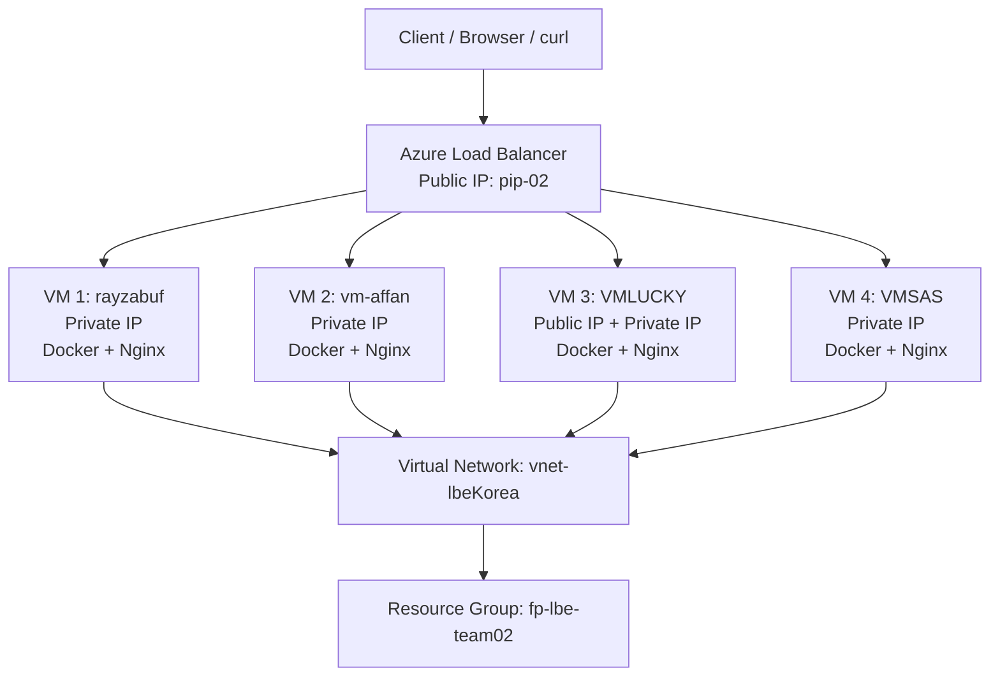

# LAPORAN FINAL PROJECT
## Lab Based Education - Azure Load Balancer

### Tim

| Informasi | Detail |
|---|---|
| Nama tim | fp=lbe-team02 |
| Nama repository | FPLBE02 |
| Nama aplikasi | Portofolio |
| Jumlah anggota/VM | 4 |
| Region Azure | Korea Central |
| Tanggal | 23 September 2026 |

## 1. Deskripsi Project

Project ini membuat aplikasi portfolio berbasis HTML, CSS, dan JavaScript yang dijalankan menggunakan Docker. Aplikasi ditempatkan pada empat Virtual Machine Azure dan diakses melalui Azure Load Balancer.

Setiap container menampilkan hostname backend pada bagian footer halaman. Informasi tersebut digunakan untuk membuktikan bahwa request dari client dapat diteruskan ke lebih dari satu VM.

## 2. Arsitektur Sistem



Arsitektur lengkap juga tersedia pada [docs/architecture.md](docs/architecture.md).

## 3. Resource Azure

Resource yang telah dibuat pada Resource Group `fp-lbe-team02`:

- Region: `Korea Central`
- Virtual Network: `vnet-lbeKorea`
- Azure Load Balancer: `lb-team02`
- Public IP Load Balancer: `pip-02`
- Virtual Machine: `rayzabuf`
- Virtual Machine: `vm-affan`
- Virtual Machine: `VMLUCKY`
- Virtual Machine: `VMSAS`
- Network Security Group tersedia untuk masing-masing VM

`VMLUCKY` adalah satu-satunya VM yang memiliki Public IP dan digunakan untuk kebutuhan administrasi. `rayzabuf`, `vm-affan`, dan `VMSAS` hanya menggunakan private IP dalam Virtual Network. Akses aplikasi tetap dilakukan melalui Public IP milik Azure Load Balancer `pip-02`, bukan melalui Public IP `VMLUCKY`.

## 4. Teknologi yang Digunakan

- HTML5
- CSS3
- JavaScript
- Docker
- Nginx Alpine
- Microsoft Azure Virtual Machine
- Microsoft Azure Virtual Network
- Microsoft Azure Load Balancer

## 5. Menjalankan Aplikasi

Image Docker dibuat menggunakan file [app/Dockerfile](app/Dockerfile).

```bash
docker build -t fplbe02-portfolio -f app/Dockerfile app
docker run -d \
  --name portfolio \
  --restart unless-stopped \
  -p 80:80 \
  -e BACKEND_HOSTNAME=$(hostname) \
  fplbe02-portfolio
```

File `entrypoint.sh` membuat konfigurasi hostname backend ketika container dijalankan. Dengan demikian, setiap VM dapat dikenali dari response aplikasi.

## 6. Konfigurasi Load Balancer

Konfigurasi yang diperlukan:

- Frontend: Public IP `pip-02`
- Frontend port: `80`
- Backend port: `80`
- Backend pool: empat VM
- Health probe: TCP port `80`
- Load balancing rule: TCP port `80` ke backend port `80`

## 7. Pengujian Distribusi Traffic

Pengujian dilakukan dengan mengirimkan request berulang ke Public IP Load Balancer:

```powershell
for ($i=1; $i -le 30; $i++) {
    (Invoke-WebRequest -Uri "http://<PUBLIC_IP_LOAD_BALANCER>" -UseBasicParsing).Content |
        Select-String -Pattern "Backend:"
}
```

Contoh hasil yang diharapkan:

```text
Backend: rayzabuf
Backend: vm-affan
Backend: VMLUCKY
Backend: VMSAS
```

Hasil aktual disimpan pada [docs/evidence/curl-loop-output.txt](docs/evidence/curl-loop-output.txt).

## 8. Bukti Implementasi

| Bukti | File | Status |
|---|---|---|
| Diagram arsitektur | [docs/architecture.md](docs/architecture.md) | Tersedia |
| Screenshot resource Azure | `docs/evidence/azure-resources.png` | Perlu ditambahkan |
| Screenshot backend pool healthy | `docs/evidence/healthy-backend-pool.png` | Perlu ditambahkan |
| Output pengujian curl | `docs/evidence/curl-loop-output.txt` | Perlu ditambahkan |
| Simulasi kegagalan VM | `docs/evidence/failure-simulation.png` | Opsional |

## 9. Kesimpulan

Aplikasi portfolio berhasil disiapkan agar dapat dijalankan dalam container Docker. Infrastruktur Azure menggunakan empat VM dalam satu Virtual Network dan satu Azure Load Balancer sebagai pintu masuk aplikasi.

Keberhasilan distribusi traffic dibuktikan apabila hasil pengujian dari Public IP Load Balancer menampilkan hostname dari minimal dua VM yang berbeda. Screenshot backend pool dengan status healthy dan output request berulang menjadi bukti utama submission.

## 10. Checklist Sebelum Submission

- [ ] Repository GitHub sudah public.
- [ ] Empat VM berada pada Resource Group dan VNet yang sama.
- [ ] Keempat VM masuk backend pool Load Balancer.
- [ ] Health probe port 80 berstatus healthy.
- [ ] NSG mengizinkan TCP port 80.
- [ ] Container berjalan pada keempat VM.
- [ ] Output curl menampilkan lebih dari satu hostname backend.
- [ ] Screenshot resource Azure ditambahkan ke `docs/evidence/`.
- [ ] Screenshot backend pool healthy ditambahkan ke `docs/evidence/`.
- [ ] Repository dikirim melalui submission form.
