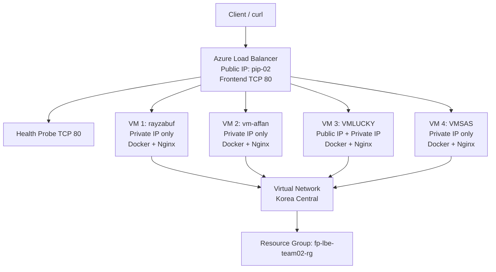

# Arsitektur FP LBE Team 02

Semua VM berada dalam satu Virtual Network dan subnet yang sama. `VMLUCKY` adalah satu-satunya VM dengan Public IP untuk akses administrasi. Tiga VM lainnya hanya memiliki private IP. Azure Load Balancer menggunakan Public IP `pip-02`, health probe pada port 80, dan mendistribusikan koneksi ke VM yang sehat melalui private IP backend.
