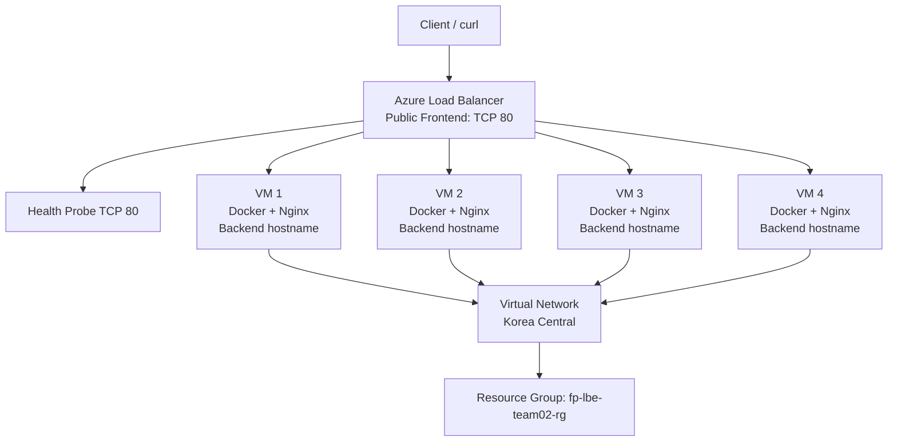

# Arsitektur FP LBE Team 02

Semua VM berada dalam satu Virtual Network dan subnet yang sama. Azure Load Balancer menggunakan health probe pada port 80 dan mendistribusikan koneksi ke VM yang sehat.
